# 概要
*このリポジトリは2025/2月現在、以下のコマンドでダウンロードできるPhenoPacketStoreのデータをvalidationしたものである*
```
https://github.com/monarch-initiative/phenopacket-store/releases/latest/download/all_phenopackets.zip
```
# json schemaについて

```mermaid
graph LR
    subgraph PhenoPacket
        id["id (必須)<br>string (PMID...)"]
        subject["subject (必須)"] --> id2["id<br>string"]
        subject --> sex["sex<br>enum (MALE, FEMALE, UNKNOWN_SEX, OTHER_SEX)"]
        subject --> timeAtLastEncounter["timeAtLastEncounter"]
        timeAtLastEncounter --> age["age"]
        age --> iso8601duration["iso8601duration<br>string"]
        timeAtLastEncounter --> ontologyClass1["ontologyClass"]
        ontologyClass1 --> id3["id<br>string (HP...)"]
        ontologyClass1 --> label1["label<br>string"]
        subject --> vitalStatus["vitalStatus"]
        vitalStatus --> status["status<br>enum (ALIVE, UNKNOWN_STATUS, DECEASED)"]
        phenotypicFeatures["phenotypicFeatures"] --> type["type"]
        type --> id4["id<br>string (HP...)"]
        type --> label2["label<br>string"]
        phenotypicFeatures --> onset["onset"]
        onset --> ontologyClass2["ontologyClass"]
        ontologyClass2 --> id5["id<br>string (HP...)"]
        ontologyClass2 --> label3["label<br>string"]
        phenotypicFeatures --> excluded["excluded<br>boolean"]
        measurements["measurements"] --> assay["assay"]
        assay --> id6["id<br>string"]
        assay --> label4["label<br>string"]
        measurements --> value["value"]
        value --> quantity["quantity (必須)"]
        quantity --> unit1["unit"]
        unit1 --> id7["id<br>string"]
        unit1 --> label5["label<br>string"]
        quantity --> value2["value<br>number"]
        quantity --> referenceRange["referenceRange"]
        referenceRange --> unit2["unit"]
        unit2 --> id8["id<br>string"]
        unit2 --> label6["label<br>string"]
        referenceRange --> low["low<br>number"]
        referenceRange --> high["high<br>number"]
        interpretations["interpretations (必須)"] --> id9["id<br>string"]
        interpretations --> progressStatus["progressStatus<br>enum (UNKNOWN_PROGRESS, IN_PROGRESS, COMPLETED, SOLVED, UNSOLVED)"]
        interpretations --> diagnosis["diagnosis"]
        diagnosis --> disease["disease"]
        disease --> id10["id<br>string (OMIM...)"]
        disease --> label7["label<br>string"]
        diagnosis --> genomicInterpretations["genomicInterpretations"]
        genomicInterpretations --> subjectOrBiosampleId["subjectOrBiosampleId<br>string"]
        genomicInterpretations --> interpretationStatus["interpretationStatus<br>enum (UNKNOWN_STATUS, REJECTED, CANDIDATE, CONTRIBUTORY, CAUSATIVE)"]
        genomicInterpretations --> variantInterpretation["variantInterpretation"]
        variantInterpretation --> variationDescriptor["variationDescriptor (必須)"]
        variationDescriptor --> id11["id<br>string"]
        variationDescriptor --> label8["label<br>string"]
        variationDescriptor --> description["description<br>string"]
        variationDescriptor --> geneContext["geneContext (必須)"]
        geneContext --> valueId["valueId<br>string (HGNC...)"]
        geneContext --> symbol["symbol<br>string"]
        variationDescriptor --> expressions["expressions"]
        expressions --> syntax["syntax<br>enum (hgvs.g, hgvs.c, hgvs.p, hgvs.m, hgvs.n, hgvs.r)"]
        expressions --> value3["value<br>string"]
        variationDescriptor --> vcfRecord["vcfRecord"]
        vcfRecord --> genomeAssembly["genomeAssembly<br>string (hg38)"]
        vcfRecord --> chrom["chrom<br>string (chr...)"]
        vcfRecord --> pos["pos<br>string"]
        vcfRecord --> ref["ref<br>string (ATGC)"]
        vcfRecord --> alt["alt<br>string (ATGC)"]
        variationDescriptor --> moleculeContext["moleculeContext<br>string"]
        variationDescriptor --> allelicState["allelicState (必須)"]
        allelicState --> id12["id<br>string (HP|GENO...)"]
        allelicState --> label9["label<br>string"]
        variationDescriptor --> structuralType["structuralType"]
        structuralType --> id13["id<br>string"]
        structuralType --> label10["label<br>string"]
        diseases["diseases (必須)"] --> term["term"]
        term --> id14["id<br>string (OMIM...)"]
        term --> label11["label<br>string"]
        diseases --> onset2["onset"]
        onset2 --> ontologyClass3["ontologyClass"]
        ontologyClass3 --> id15["id<br>string (HP...)"]
        onset2 --> age2["age"]
        age2 --> iso8601duration2["iso8601duration<br>string"]
        metaData["metaData (必須)"] --> created["created<br>string (YYYY)"]
        metaData --> createdBy["createdBy<br>string"]
    end
```



# json schemaの概要について  
PhenoPacketStoreのデータには現状PhenoPacketSchemaのtop level要素のPhenoPacket以下の要素のみが含まれている  
# プロパティ一覧　　

## 最上位のプロパティ  
id, subject, interpretations, diseases, metaDataはすべてのデータに含まれる  
[**id**](#id)  
[**subject**](#subject)  
[**PhenotypicFeatures**](#PhenotypicFeatures)  
[**measurements**](#measurements)  
[**interpretation**](#interpretations)  
[**diseases**](#diseases)  
[**metaData**](#metaData)  

## id
phenopacketデータのidである。PMIDで始まる形式で表記される。PMID+個人を識別するid(subject_id)で構成される。  
[**最上位**](#https://github.com/708san/phenopacket_check/edit/main/README.md#最上位のプロパティ)


## subject
検体の情報を表すobject型であり、以下のようなpropertyを持っている。idのみすべてのデータに含まれている  
[**id(subject)**](#id(subject))  
[**sex**](#sex)  
[**timeAtLastEncounter**](#timeAtLastEncounter)  
[**vitalstatus**](#vitalstatus)  

## PhenotypicFeatures
表現型を記述する。配列型であり、配列の一つの要素は以下のようなプロパティを持つobject型である。typeはすべてに含まれている。   
[**type**](#type)  
[**onset**](#onset)  
[**excluded**](#excluded)    

## measurements  
測定値を記述する。配列であり、配列の一つの要素は以下のようなプロパティを持つobject型である。assayとvalueはすべてに含まれる。  
[**assay**](#assay)  
[**value**](#value)  


## interpration  
病気や診断の結果を記述する。配列であり、配列の一つの要素は以下のようなプロパティを持つobject型である。id、progressStatus、diagnosisは全てに含まれる。  
[**id(subject)**](#id(subject))  
[**progressStatus**](#progressStatus)  
[**diagnosis**](#diagnosis)  

## diseases  
疾患について記述する。配列であり、配列の一つの要素は以下のようなプロパティを持つobject型である。termは全てに含まれる。  
[**term**](#term)  
[**onset**](#onset)  

## metaData
データの作られた日やオントロジーについて記述する。object型であり、以下のようなプロパティを持つ。created, createdBy, resources, phenopacketSchemaVersion, externalReferencesはすべてのデータに含まれる。  
[**created**](#created)  
[**createdBy**](#createdBy)   
[**resources**](#resources)  
[**phenopacketSchemaVersion**](#phenopacketSchemaVersion)  
[**externalReferences**](#externalReferences)  


## id(subject)
個人を識別するid.  

## sex
[被験者](#subject)の性別。UNKNOWN_SEX,FEMALE,MALE,OTHER_SEXの4値で与えられる。  
UNKNOWNは記録なし、OTHER_SEXは性別の判別ができない場合。

## timeAtLastEncounter
[被験者](#subject)表現形の観察時の時間情報を示す。object型で以下のプロパティを持つ.  
[**age**](#age)  
[**ontologyClass**](#ontologyClass)  

## vitalstatus
生存情報を示すobject型のデータ。以下のプロパティを持つ。  
[**status**](#status)  
[**timeOfDeath**](#timeOfDeath)  

## type
表現型のオントロジを記述する。以下のプロパティを持っている。id,ラベルともに全てに含まれる  
[**id(HPO)**](#idHPO)  
[**label(HPO)**](#labelHPO)  

## onset  
その表現型や症状が初めて確認、診断された時間について記述されている。object型で以下のpropertyを持っている。  
[**ontologyClass**](#ontologyclass)  
[**age**](#age)  

## excluded  
その表現型や症状が見られ**なかった**時に明示的に与えられる。bool型で与えられる(false)  

## assay  
測定が行われた場合のその手法や結果を示している。配列で与えられ、配列の要素はobject型で以下の要素を持っている。assay,valueとも全てに含まれている  
[**id(assay)**](#idassay)  
[**label(assay)**](#labelassay)  

## value
assayに対する測定値を示している。object型であり、quantityを必ず持つ。  
[**quantity**](#quantity)  

## progressStatus  
診断の状態を示す。以下の値を持ちうる  
**UNKNOWN_PROGRESS**:情報なし  
**IN_PROGRESS**:確定しておらず診断が行われている途中  
**COMPLETED**:診断終了  
**SOLVED**:診断完了し確定診断がなされている  
**UNSOLVED**:診断完了したが確定診断なし  

## diagnosis  
診断の結果存在することが推定された疾患について病名及び遺伝子への所見を示している。object型であり、以下のプロパティを持つ。disease,genomicInterpretationsは全てに含まれる。  
[**disease**](#disease)  
[**genomicInterpretation**](#genomicinterpretation)  

## term  
疾患に関するOMIMタームを示す。object型であり、idとlabelを必ず含む  
[**id(OMIM)**](#idomim)  
[**label(OMIM)**](#labelomim)  


## created  
phenopacketデータの作成時がdate-time形式(ISO8601)の形で与えられている  

## createdby  
データの作成者を表すstring形式のデータ  

## resources  
オントロジーやその他のデータで利用したものをリソースとして表示している。配列型であり各要素は以下のプロパティを持つobject型である。すべてのプロパティが必ず含まれている。  
[**id(resources)**](#idresources)  
[**name(resources)**](#nameresources)  
[**url**](#url)  
[**version**](#version)  
[**namespacePrefix**](#namespacePrefix)  
[**iriPrefix**](#iriPrefix)  


## phenopacketSchemaVersion  
データが利用しているphenopacketSchemaのバージョンを示すstring型。  

## externalReferences
論文へのリファレンスを示している。object型のデータで以下のすべてのプロパティが必ず含まれている。  
[**id(PMID)**](#idpmid)  
[**reference**](#reference)
[**description**](#description)

## status
生きているか死んでいるかを表す。UNKNOWN_STATUS,ALIVE,DECEASEDのいずれかの値を持つ。  


## timeOfDeath
患者の死亡時を表す。object型で以下のプロパティを持つ。  
[**age**](#age)  
[**ontologyClass**](#ontologyclass)  

## age    
年齢を示す。次のプロパティが必ず含まれている。  
[**iso8601duration**](#iso8601duration)  

## quantity  
単位及び量を示す。以下のプロパティを持つobject型であり、unitとvalueは必ず含まれている。  
[**unit**](#unit)  
[**value**](#valuenumber)  
[**referenceRange**](#referncerange)  

## disease
[診断](#diagnosis)された疾患についてオントロジーの形で与えられたオブジェクト型である。以下のプロパティを必ず含む。  
[**id(OMIM)**](#idomim)  
[**label(OMIM)**](#labelomim)  

## genomicInterpretation
[診断](#diagnosis)されたバリアントの情報を示す。配列型であり、一つの要素は以下のプロパティを持つobject型である。subjectOrBiosampleId, interpretationStatus, variantInterpretationは全てに含まれる。  
[**subjectOrBiosampleId**](#subjectorbiosampleid)  
[**interpretationStatus**](#interpretationstatus)  
[**variantInterpretation**](#variantinterpretation)  


## id(HPO)  
HPOのidを示す  

## label(HPO)  
HPOのラベルを示す。  

## id(OMIM)  
OMIMのidを示す  

## label(OMIM)  
OMIMのラベルを示す。  


## id(resources)
利用しているオントロジーなどの[リソース](#resources)についてidで表したもの。  

## name(resources)
リソースの正式名称。  

## url  
urlである。  

## version  
使用したリソースのバージョンを示す。  

## namespacePrefix  
CURIEで使用されるprefix  

## iriPrefix  
iriのprefixである  


## id(PMID)  
論文のPMIDを示す。  


## reference  
リファレンス論文へのリンクを示す。  

## description  
リファレンス論文のタイトルを示す.  

## OntologyClass  
onsetや時期の情報についてHPOタームで記述したオブジェクト型である。idとlabelを必ず含んでいる。  
プロパティ  
[**id(HPO)**](#idhpo)  
[**label(HPO)**](#labelomim)

## iso8601duration  
年齢の記述で用いられている。iso8601durationの形式で与えられている。  


## unit  
単位について記述したobject型のデータである。以下のプロパティを必ず含んでいる。  
[**id(unit)**](#idunit)  
[**label(unit)**](#labelunit)  

## value(number)  
[assay](#assay)による測定値を示した数値データである。unitと組み合わせて使用される。  

## referenceRange
[value(number)](#valuenumber)の取りうる通常の値を示したobject型のデータである。以下のすべてのプロパティを必ず持つ  
[**unit**](#unit)  
[**low**](#low)  
[**high**](#high)  

## subjectOrBiosampleId  
[被験者のid](#idsubject)もしくはバイオサンプルのidを示した文字列。  

## interpretationStatus  
[genomic interpretation](#genomicinterpretation)の[バリアント](#variantinterpretation)が[疾患](#disease)に関連しているかを示している。次の5つの値のいずれかを取りうる。  
**CAUSATIVE**：バリアントは疾患の原因である  
**CONTRIBUTORY**:バリアントは疾患と関連している  
**CANDIDATE**:バリアントは疾患と関連している可能性がある  
**REJECTED**:バリアントは疾患と関係がない  
**UNKNOWN_STATUS**:わからない  


## variantInterpretation  
ACMGによるバリアントのinterpretationのガイドラインに従ったinterpretationを示すobject型である。同じくobject型である、variationDescriptorのみを含んでいる  
プロパティ  
[**variationDescriptor**](#variationdescriptor)  

## variationDescriptor  


