# 概要
*このリポジトリは2025/2月現在、以下のコマンドでダウンロードできるPhenoPacketStoreのデータをvalidationしたものである*
```
https://github.com/monarch-initiative/phenopacket-store/releases/latest/download/all_phenopackets.zip
```
# json schemaについて

```mermaid
graph LR
    subgraph PhenoPacket
        id["id (必須)<br>string (PMID...)"]
        subject["subject (必須)"] --> id2["id<br>string"]
        subject --> sex["sex<br>enum"]
        subject --> timeAtLastEncounter["timeAtLastEncounter"]
        timeAtLastEncounter --> age["age"]
        age --> iso8601duration["iso8601duration<br>string"]
        timeAtLastEncounter --> ontologyClass1["ontologyClass"]
        ontologyClass1 --> id3["id<br>string (HP...)"]
        ontologyClass1 --> label1["label<br>string"]
        subject --> vitalStatus["vitalStatus"]
        vitalStatus --> status["status<br>enum"]
        phenotypicFeatures["phenotypicFeatures"] --> type["type"]
        type --> id4["id<br>string (HP...)"]
        type --> label2["label<br>string"]
        phenotypicFeatures --> onset["onset"]
        onset --> ontologyClass2["ontologyClass"]
        ontologyClass2 --> id5["id<br>string (HP...)"]
        ontologyClass2 --> label3["label<br>string"]
        phenotypicFeatures --> excluded["excluded<br>boolean"]
        measurements["measurements"] --> assay["assay"]
        assay --> id6["id<br>string"]
        assay --> label4["label<br>string"]

        measurements --> value["value"]
        value --> quantity["quantity"]
        quantity --> unit1["unit"]
        unit1 --> id7["id<br>string"]
        unit1 --> label5["label<br>string"]
        quantity --> value2["value<br>number"]
        quantity --> referenceRange["referenceRange"]
        referenceRange --> unit2["unit"]
        unit2 --> id8["id<br>string"]
        unit2 --> label6["label<br>string"]

        referenceRange --> low["low<br>number"]
        referenceRange --> high["high<br>number"]


        interpretations["interpretations (必須)"] --> id9["id<br>string"]
        interpretations --> progressStatus["progressStatus<br>enum"]
        interpretations --> diagnosis["diagnosis"]
        diagnosis --> disease["disease"]
        disease --> id10["id<br>string (OMIM...)"]
        disease --> label7["label<br>string"]
        diagnosis --> genomicInterpretations["genomicInterpretations"]
        genomicInterpretations --> subjectOrBiosampleId["subjectOrBiosampleId<br>string"]
        genomicInterpretations --> interpretationStatus["interpretationStatus<br>enum"]
        genomicInterpretations --> variantInterpretation["variantInterpretation"]
        variantInterpretation --> variationDescriptor["variationDescriptor"]
        variationDescriptor --> id11["id<br>string"]
        variationDescriptor --> label8["label<br>string"]
        variationDescriptor --> description["description<br>string"]
        variationDescriptor --> geneContext["geneContext"]
        geneContext --> valueId["valueId<br>string (HGNC...)"]
        geneContext --> symbol["symbol<br>string"]
        variationDescriptor --> expressions["expressions"]
        expressions --> syntax["syntax<br>enum"]
        expressions --> value3["value<br>string"]
        variationDescriptor --> vcfRecord["vcfRecord"]
        vcfRecord --> genomeAssembly["genomeAssembly<br>string (hg38)"]
        vcfRecord --> chrom["chrom<br>string (chr...)"]
        vcfRecord --> pos["pos<br>string"]
        vcfRecord --> ref["ref<br>string (ATGC)"]
        vcfRecord --> alt["alt<br>string (ATGC)"]
        variationDescriptor --> moleculeContext["moleculeContext<br>string"]
        variationDescriptor --> allelicState["allelicState"]
        allelicState --> id12["id<br>string (HP|GENO...)"]
        allelicState --> label9["label<br>string"]
        variationDescriptor --> structuralType["structuralType"]
        structuralType --> id13["id<br>string"]
        structuralType --> label10["label<br>string"]

        diseases["diseases (必須)"] --> term["term"]
        term --> id14["id<br>string (OMIM...)"]
        term --> label11["label<br>string"]
        diseases --> onset2["onset"]
        onset2 --> ontologyClass3["ontologyClass"]
        ontologyClass3 --> id15["id<br>string (HP...)"]
        ontologyClass3 --> label12["label<br>string"]
        onset2 --> age2["age"]
        age2 --> iso8601duration2["iso8601duration<br>string"]

        metaData["metaData (必須)"] --> created["created<br>string (YYYY)"]
        metaData --> createdBy["createdBy<br>string"]
        metaData --> resources["resources"]
        resources --> id16["id<br>string"]
        resources --> name["name<br>string"]
        resources --> url["url<br>string"]
        resources --> version["version<br>string"]
        resources --> namespacePrefix["namespacePrefix<br>string"]
        resources --> iriPrefix["iriPrefix<br>string"]
        metaData --> phenopacketSchemaVersion["phenopacketSchemaVersion<br>string"]
        metaData --> externalReferences["externalReferences"]
        externalReferences --> id17["id<br>string (PMID...)"]
        externalReferences --> reference["reference<br>string"]
        externalReferences --> description2["description<br>string"]


    end
```



